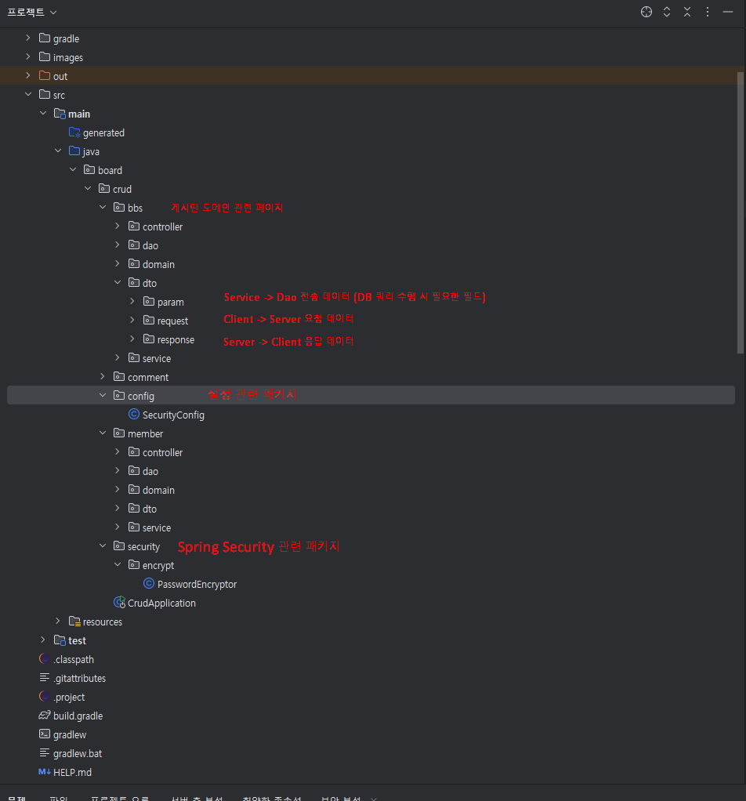

# Bulletin Board System

**게시판** 웹 어플리케이션 프로젝트입니다.

2025 03. 24 ~ 2025.04.23 까지 약 한달동안 `React`를 학습하며 `Spring Boot`와  `React`를 사용해 구현했습니다. 

이 프로젝트를 통해 이루고자 한 목표는 Spring에서 제공하는 프레임워크를 사용해보기, React 적용해보기였습니다. 프로젝트 구현 과정 동안 세션 회원 인증/허가,  좋아요 트랜잭션 동시성 처리에 대해 고민하며 

코드를 작성했습니다.

---
## 📚 목차


- [🔐 보안 설정 가이드](#-보안-설정-가이드)
  - [✅ 숨긴 설정 파일](#-숨긴-설정-파일)
  - [⚙️ 설정 방법](#-설정-방법)
- [로그](#로그)
- [프로젝트 구조](#프로젝트-구조)
- [사용 기술](#사용-기술)
- [구현 기능](#구현-기능)
- [기능 실행화면](#기능-실행화면)
- [게시판 기능](#게시판-기능)
  - [모든 게시글 및 특정 게시글 조회](#모든-게시글-및-특정-게시글-조회)
  - [게시글 작성](#게시글-작성)
  - [게시글 수정](#게시글-수정)
- [댓글 기능](#댓글-기능)
  - [댓글 조회](#댓글-조회)
  - [댓글 작성](#댓글-작성)
- [회원 기능](#회원-기능)
  - [회원가입](#회원가입)
  - [로그인-로그아웃](#로그인-로그아웃)
- [API 명세서](#api-명세서)
- [ERD설계](#erd설계)
- [트러블슈팅](#트러블슈팅)
  
## 🔐 보안 설정 가이드

이 프로젝트는 민감한 설정 정보를 Git에 포함하지 않고 관리합니다.

## ✅ 숨긴 설정 파일

- `src/main/resources/application.properties`
- `src/main/resources/application-secret.properties`

## ⚙️ 설정 방법

1. `application.properties`에 아래와 같이 작성하세요.

spring.application.name=crud
spring.config.import=optional:classpath:application-secret.properties<br>

2.application-secret.properties 파일을 직접 생성하고, 아래 내용처럼 작성하세요:

spring.datasource.username=YOUR_DB_USERNAME<br>
spring.datasource.password=YOUR_DB_PASSWORD<br>
예시는 application-secret-example.properties 파일을 참고하세요<br>

## 로그

- 2025-04-10 git log에 이전 db정보남아있어서 db정보 자체변경

## 프로젝트 구조

**BackEnd**

물론입니다. 마크다운(`.md`) 파일에 바로 복사해서 사용할 수 있도록 코드 블록 형식으로 만들어 드리겠습니다.

아래 내용을 그대로 복사해서 붙여넣기 하시면 됩니다.

-----

### 📂 Backend 디렉토리 구조

```
src
├── main
│   ├── java
│   │   └── Board
│   │       └── crud
│   │           ├── CrudApplication.java
│   │           ├── bbs                       <--- 게시판 도메인 관련 페이지
│   │           │   ├── controller
│   │           │   ├── dao
│   │           │   ├── domain
│   │           │   ├── dto
|   |           |       ├── param      Service <--- Dao 전송 데이터 (DB 쿼리 수행시 필요한 필드)
|   |           |       ├── request    Client <--- Server 요청 데이터
|   |           |       ├── response   Server <--- Client 응답 데이터 
│   │           │   └── service
│   │           ├── comment
│   │           │   ├── controller
│   │           │   ├── dao
│   │           │   ├── domain
│   │           │   ├── dto
│   │           │   └── service
│   │           ├── config                     <---  설정 관련 패키지
│   │           │   └── SecurityConfig.java   
│   │           └── member
│   │           |    ├── controller
│   │           |    ├── dao
│   │           |    ├── domain
│   │           |    ├── dto
│   │           |    └── service
│   │           └── member
│   │           └── security      <--- Spring Security 관련 패키지 
│   │           |    └── encrypt
│   │           |           └── PasswordEncryptor
│   └── resources
│       ├── mapper
│       ├── static
│       └── templates
└── test
    └── java
        └── Board
            └── crud
                └── CrudApplicationTests.java
```

\<br\>





**Frontend** 📂 Frontend 디렉토리 구조


```
public
└── images
src
├── Components
│   ├── api
│   │   ├── CommentApi.jsx
│   │   ├── bbsApi.jsx
│   │   └── likeApi.jsx
│   ├── app
│   │   ├── Footer.jsx
│   │   ├── Header.jsx
│   │   ├── Home.jsx
│   │   ├── Main.jsx
│   │   └── Nav.jsx
│   ├── bbs
│   │   ├── BbsDetail.jsx
│   │   ├── BbsList.jsx
│   │   ├── BbsUpdate.jsx
│   │   └── BbsWrite.jsx
│   ├── comment
│   │   ├── Comment.jsx
│   │   ├── CommentList.jsx
│   │   └── CommentWrite.jsx
│   ├── context
│   │   └── LoginProvider.jsx
│   ├── member
│   │   ├── Join.jsx
│   │   ├── Login.jsx
│   │   └── Logout.jsx
│   └── router
│       └── Router.jsx
└── css
    ├── bbslist.css
    ├── page.css
    └── style.css
```


## 사용 기술

**Backend**

| 기술 | 버전 |
| --- | --- |
| Spring Boot | 3.4.3 |
| Spring Sercurity | 6.2.2 |
| Lombok | 적용 |
| MyBatis | 3.0.4 |
| MySQL ConnentorJ | 8.0.33 |
| Apach JMeter | 5.6.3 |

**Frontend**

| NodeJS | 22.14.0 |
| --- | --- |
| React | 16.2.0 |
| react-axios | 1.8.2 |
| react-dom | 19.0.0 |
| react-js-pagination | 3.0.3 |
| react-router-dom | 6.3.0 |
| react-scripts | 5.0.1 |

## 구현 기능

- 게시판 기능
    - 모든 게시글 및 특정 게시글 조회
    - 게시글 검색 (제목, 내용, 작성자)
    - 게시글 작성 [회원]
    - 게시글 수정 [회원, 게시글 작성자]
    - 게시글 삭제 [회원, 게시글 작성자]
    - 게시글 답글 작성 [회원]
- 댓글 기능
    - 댓글 조회
    - 댓글 작성 [회원]
- 회원 기능
    - 회원가입
    - 로그인/로그아웃

## 기능 실행화면

---

## 게시판 기능

### 모든 게시글 및 특정 게시글 조회

- 모든 게시글을 조회할 수 있습니다. 페이징 기능을 통해 한 페이지에서 최대 10개의 게시글이
    
    조회됩니다.
    
    
    
    
    
- 게시글 제목을 클릭하면, 게시글의 상세 내용을 조회할 수 있습니다.


**게시글 검색**

- 게시글의 제목과 내용 또는 작성자로 게시글을 검색할 수 있습니다.


### 게시글 작성

- 로그인한 사용자는 게시글을 작성할 수 있습니다.
    
    
    


- 로그인 하지 않았을 경우 글 작성이 제한됩니다.


### 게시글 수정

- 게시글 작성자는 게시글을 수정할 수 있습니다.


- 자신이 작성한 게시글에만 수정, 삭제 버튼이 활성화됩니다.


**게시글 삭제**

- 게시글 작성자는 게시글을 삭제할 수 있습니다.


## 댓글 기능

---

### 댓글 조회

- `게시글 상세`에서 관련된 댓글을 조회할 수 있습니다.
    
    
    

### 댓글 작성

- 로그인한 사용자는 댓글을 작성할 수 있습니다.
    
    
    

## 회원 기능

---

### 회원가입

- 회원가입 시 아이디 중복을 체크합니다.


- 회원가입을 통해 서비스에 사용자 정보를 입력합니다.


### 로그인/ 로그아웃

- 로그인
    
    
    


- 로그인을 완료하면 브라우저의 Local Storage에 사용자 id와 정보를 저장합니다.
    
    
    

- 로그아웃
    
    
    
    

## API 명세서

---


## ERD설계

---


## 트러블슈팅

---

### 리팩토링을 통해 DTO 클래스 분리


기존은 DTO없이 domain을 바로 넘겨 client가 알 필요없고 알아서도 안되는 기존 정보 모두를 넘겨주었고 보안에도 문제가 생긴다고 판단, 

그에 더해 dto구조를 도입함으로써  요청과 응답으로 주고받는 데이터를 한 눈에 확인할 수 있겠다고 생각되었고  요청받은 데이터를 바탕으로 SQL쿼리를 수행할 때 필요한 데이터만을 넘겨주기위해 Service에서 DAO로 넘기는 파라미터도 DTO를 분리했습니다.

이렇게 구현했을 때의 **장점**은 

컨트롤러 메서드의 파라미터로 많은 인자를 넘겨주지 않고 필요한 인자만 넘겨주면 된다는 점,
주고받는 데이터를 확인하고 수정해야하는 경우 
DTO만 수정해주면 되는 유지보수성이 장점입니다.

하지만 **단점**은 기능이 추가될 때마다 클래스 파일이 늘어나 관리가 힘들어진다는 점, 데이터를 한 눈에 확인할 수 있지만 그러기 위해서는 직접 클래스 파일을 열어봐야 한다는 번거로움이 있습니다.


### ’좋아요’ 트랜잭션 Race Condition 동시성 제어
게시글의 좋아요 기능을 구현한 이후, 동일 사용자가 여러 번 요청 시 중복된 insert/ delete로 인해 
like_count 값이 꼬일 수 있는 `Race Condition` 문제가 발생할 수 있음을 확인했습니다.
이를 개선하기 위해 Jmeter를 활용해 100건의 동시 요청 테스트를 수행했습니다.

<br>

<br>


우선 `For update` 를 쓰기위해 mySql이 innoDB 자격이 있는지부터 체크했습니다.


<br>


`JMeter`에서 401이 뜨는 바람에  JMeter Test API를 새로 넣어주었고
`session 권한 주입` 후  테스트를 진행할 수 있었습니다.


<br>

<br>
bbs_like 테이블에 `insert`가  `1건 발생`했는지 확인했고


<br>


<br>
100여건의 요청에도 불구하고 단 한번의 좋아요가 
들어간 것을 알 수 있었고 이로서<br>
중복 `count`증가 없이 데이터 `정합성이 유지`되었음을 확인했습니다.


이로서  단순 @Trancsactial + FOR UPDATE 조합으로 <br>
실제 동시 요청 상황에서도 Race Condition을 방지하고 <br>
데이터 정합성을 보장했습니다.

