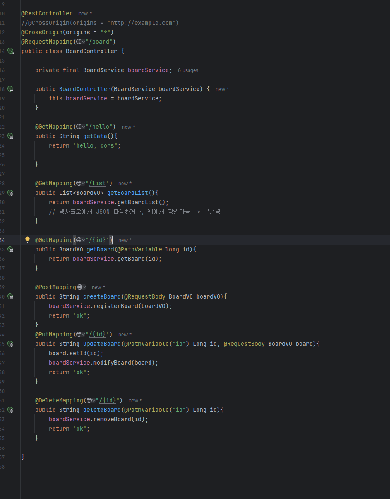

# Toy_CRUD_A
## 목차

- [예시1](#예시-위한-체크1)
- [예시2](#예시를-위한-체크2)
- [예시3](#예시를-위한-체크3)
- [깃 사용에 있어](#어떤-것들인지)
- [코드 캡쳐 예시](#예시캡쳐넣기-Capture)

## 예시1 
이런식으로 하면 앵커가 되는것인지

## 예시2
- 기능 1
- 기능 2
- .........

## 예시3
- ㅇㄹㅇㄹㅇㄹ
- ㅇㄹㅇㄹㅇ

## 깃 사용에 있어
- 어떤 것들이 있는지 자세하게 해보기

## 코드 캡쳐 예시
- 
- 

